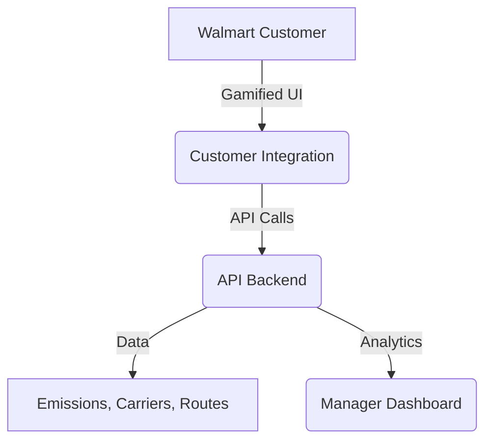

# RouteZero

[](https://youtu.be/eC2GLgUIHks)

**Zero Emissions. Infinite Scale. Walmart’s Intelligent Logistics Layer.**

---

## Executive Summary

RouteZero is Walmart’s next-generation logistics intelligence platform, engineered to cut costs, reduce emissions, and drive customer loyalty at scale. Every day, thousands of vehicles traverse millions of miles across Walmart’s supply chain. RouteZero leverages AI, real-time data, and gamification to optimize every mile—delivering up to 40% cost savings and 34% lower CO₂ emissions, while engaging customers and upskilling associates.

---

## Architecture



- **API Backend (FastAPI, Python):** Central intelligence for routing, emissions, and explainability
- **Manager Dashboard (business_facing, Next.js):** B2B operational command center for Walmart managers and fleet operators
- **Customer Integration (frontend-ui, React):** B2C layer for Walmart.com, gamifying greener delivery choices

---

## Core Engines

- **Carbon-Aware Routing:** Optimizes for lowest carbon per mile using elevation, traffic, load, and emissions data
- **Smart Carrier Matching:** Dynamically assigns EVs, hybrids, or diesel for optimal sustainability and cost
- **Pickup-Hub Optimization:** Leverages Walmart stores as micro-distribution hubs, clustering deliveries for fewer trips and less idle time
- **LLM Explainability:** Every routing decision is transparent and AI-aligned, with plain-English explanations for managers and customers

---

## Features

### Manager Dashboard (B2B)
A real-time command center for Walmart’s supply chain managers, fleet operators, and associates:

- **Executive Overview:** Live KPIs—carbon footprint, fleet efficiency, active routes, weekly savings
- **Route Planning:** Plan, optimize, and bulk-manage thousands of deliveries; eco, cost, and time priorities
- **Fleet Management:** Monitor vehicle status (EV, hybrid, diesel), live tracking, maintenance, and driver assignment
- **Hub Management:** Oversee 8,000+ micro-distribution hubs, vehicle allocation, charging, and capacity
- **Analytics:** Emissions trends, cost analysis, performance, and emissions hotspots
- **Bulk Operations:** Optimize and dispatch routes in batches, track savings and issues
- **Alerts & Quick Actions:** Real-time alerts for emission spikes, maintenance, and optimization opportunities
- **LLM Explainability:** AI-generated, plain-English explanations for every routing and fleet decision

### Customer Integration (B2C)
A gamified, loyalty-driven experience for Walmart.com customers:

- **Eco Points & Smart Rescheduling:** Customers earn rewards for greener delivery windows (e.g., “Switch to Friday, earn 30 Eco Points, cashback, or coupons”)
- **Carbon Receipt System:** Every delivery comes with a shareable receipt showing CO₂ saved, packaging reused, and delivery tier
- **LLM Explainability:** Every route, vehicle, and delivery time is explained in plain English, aligned with Walmart’s Responsible AI policy
- **Customer Loyalty Loop:** Top green customers earn extra coupons, next-day delivery credits, and sweepstakes entries—turning sustainability into stickiness and higher basket size
- **Seamless Nudges:** 65% opt-in rate for greener delivery choices in pilot

---

## API Reference (Backend)

All endpoints are served from the FastAPI backend. Example base URL: `http://localhost:8000`

### `/route-options` (POST)
Get optimized, carbon-aware route options between two points.

**Request:**
```json
{
  "source": [77.6413, 12.9716],
  "destination": [72.8777, 19.0760]
}
```
**Response:**
```json
{
  "routes": [
    {
      "distance_km": 843.2,
      "duration_min": 720.5,
      "emissions_grams": 162000,
      "emission_level": "high",
      "eco_tag": "non_eco",
      "eco_points": 0,
      "carrier_type": "diesel",
      "carrier_score": 0.9,
      "green_carrier": {
        "recommended_vehicle": "hybrid",
        "reasoning": "Hybrid optimal for this distance",
        "feasibility_score": 0.85,
        "eco_impact": "medium",
        "recommended_emissions_grams": 75888,
        "emissions_saved_grams": 86112,
        "recommended_eco_points": 30,
        "points_gained": 30
      }
    }
  ]
}
```

### `/generate-explanation` (POST)
Get an LLM-powered, plain-English explanation for a route.

**Request:**
```json
{
  "route": { ...routeObject },
  "user_context": "Customer wants to minimize emissions"
}
```
**Response:**
```json
{
  "success": true,
  "data": {
    "explanation": "This route uses a hybrid vehicle, saving 86kg CO₂ compared to diesel...",
    "confidence": 0.95,
    ...
  }
}
```

### `/reverse-logistics` (POST)
Optimize returns with deliveries (reverse logistics pairing).

**Request:**
```json
{
  "deliveries": [{"id": "d1", "lat": 12.9716, "lon": 77.6413}],
  "returns": [{"id": "r1", "lat": 12.9750, "lon": 77.6450}]
}
```
**Response:**
```json
{
  "success": true,
  "data": {
    "paired_routes": [...],
    "unpaired_deliveries": [...],
    "unpaired_returns": [...],
    "total_pairs": 1,
    ...
  }
}
```

### `/freight-options` (POST)
Get optimized freight (long-haul) route options and emissions.

**Request:**
```json
{
  "source": [77.6413, 12.9716],
  "destination": [72.8777, 19.0760],
  "mode": "rail_freight"
}
```
**Response:**
```json
{
  "freight_route": {
    "distance_km": 843.2,
    "duration_min": 630.0,
    "emissions_grams": 16864,
    "freight_emission_level": "low",
    "vehicle_type": "rail_freight",
    "recommended_mode": "ship_barge",
    "emissions_saved_grams": 16000,
    "percent_emissions_saved": 48.7,
    "best_emissions_grams": 8684
  }
}
```

### `/health` (GET)
Health check for all backend services.

**Response:**
```json
{
  "status": "healthy",
  "services": {
    "route_optimization": "available",
    "green_carrier_matching": "available",
    "eco_points_calculation": "available",
    "reverse_logistics": "available",
    "llm_explanation": "available"
  }
}
```

---

## Tech Stack

- **Backend:** Python, FastAPI, OpenRouteService, Pydantic, Uvicorn
- **Manager Dashboard:** Next.js, React, Tailwind CSS, Recharts
- **Customer Integration:** React, Leaflet, Google Maps API, Tailwind CSS

**Backend dependencies:**
```
annotated-types, anyio, certifi, charset-normalizer, click, exceptiongroup, fastapi, h11, httpx, idna, openrouteservice, pydantic, pydantic_core, python-dotenv, requests, sniffio, starlette, typing-inspection, typing_extensions, urllib3, uvicorn
```

---

## Setup & Installation

### 1. API Backend
```bash
cd RouteZero
python -m venv venv
source venv/bin/activate  # or venv\Scripts\activate on Windows
pip install -r requirements.txt
uvicorn main:app --reload
```

### 2. Manager Dashboard
```bash
cd business_facing/dashboard
npm install
npm run dev
```

### 3. Customer Integration Layer
```bash
cd frontend-ui
npm install
npm start
```

---

## Business Impact

- 💰 **20–40% drop in fuel & logistics ops cost**
- 📦 **Waste reduced via smart batching and real-time updates**
- ♻️ **34% average CO₂ savings per route**
- 🛍️ **+11% customer retention via Eco Point gamification**
- 🧠 **Associate upskilling with transparent AI explanations**
- 🎯 **Aligned with Project Gigaton, 2040 zero-emissions fleet, and AI-powered retail 2.0**

---

## Contributing
Pull requests are welcome! For major changes, please open an issue first to discuss what you would like to change.

---

## License
[MIT](LICENSE)


