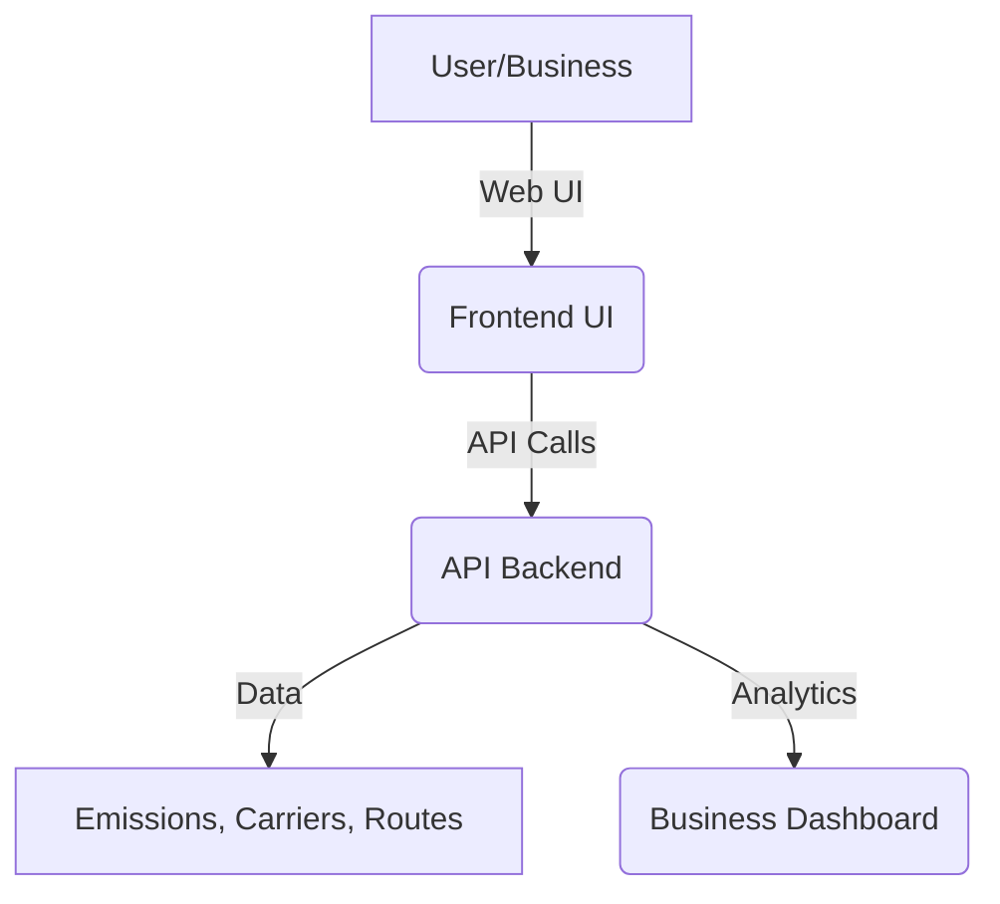

# RouteZero

[](https://youtu.be/eC2GLgUIHks)

Eco-friendly Route Optimization Platform

---

## 📽️ Video Demo

[Click here to watch the demo on YouTube](https://youtu.be/eC2GLgUIHks)

---

## Overview

**RouteZero** is a comprehensive platform for sustainable logistics and delivery optimization. It provides:
- **API backend** for eco-friendly route planning, emissions calculation, and green carrier selection
- **Business-facing dashboard** for analytics and fleet management
- **User-facing frontend** for route visualization and carbon impact awareness

---

## Architecture



- **Backend (FastAPI)**: Provides RESTful APIs for route optimization, emissions, eco-points, and reverse logistics.
- **Business Dashboard (Next.js)**: Visualizes fleet emissions, KPIs, and trends for business users.
- **Frontend UI (React)**: User-facing app for route planning, carbon receipts, and eco-friendly delivery options.

---

## Features

### Backend (Python/FastAPI)
- **Route Optimization**: Uses OpenRouteService for multi-modal route planning
- **Emissions Calculation**: Calculates CO2 emissions for last-mile and freight (car, hybrid, EV, truck, rail, ship)
- **Eco Points & Tags**: Assigns eco-friendliness scores and tags to routes
- **Green Carrier Selection**: Recommends optimal vehicle type (EV, hybrid, diesel) based on distance and sustainability
- **Reverse Logistics**: Pairs returns with deliveries to minimize extra trips
- **Freight Emissions**: Estimates and recommends best freight mode (truck, rail, ship)

### Business Dashboard (Next.js)
- Fleet emissions analytics
- Emissions trends and KPIs
- Route and hub management
- Modern, responsive UI (Tailwind CSS)

### Frontend UI (React)
- Address autocomplete and route map
- Carbon receipt generator
- Product and order management
- User profile and eco-impact tracking

---

## Tech Stack

- **Backend**: Python, FastAPI, OpenRouteService, Pydantic, Uvicorn
- **Business Dashboard**: Next.js, React, Tailwind CSS, Recharts
- **Frontend UI**: React, Leaflet, Google Maps API, Tailwind CSS

---

## Setup & Installation

### 1. Backend (API)
```bash
cd RouteZero
python -m venv venv
source venv/bin/activate  # or venv\Scripts\activate on Windows
pip install -r requirements.txt
uvicorn main:app --reload
```

### 2. Business Dashboard
```bash
cd business_facing/dashboard
npm install
npm run dev
```

### 3. Frontend UI
```bash
cd frontend-ui
npm install
npm start
```

---

## API Endpoints (Backend)
- `/route-options` — Get optimized routes between two points
- `/generate-explanation` — Get LLM-based eco-explanation for a route
- `/reverse-logistics` — Optimize returns with deliveries
- `/freight-options` — Get freight route and emissions estimate
- `/health` — Health check

---

## Configuration
- Set environment variables in a `.env` file for API keys (e.g., `ORS_API_KEY`, `LLM_API_URL`)
- See `requirements.txt` for backend dependencies
- See each `package.json` for frontend dependencies

---

## Contributing
Pull requests are welcome! For major changes, please open an issue first to discuss what you would like to change.

---

## License
[MIT](LICENSE)


