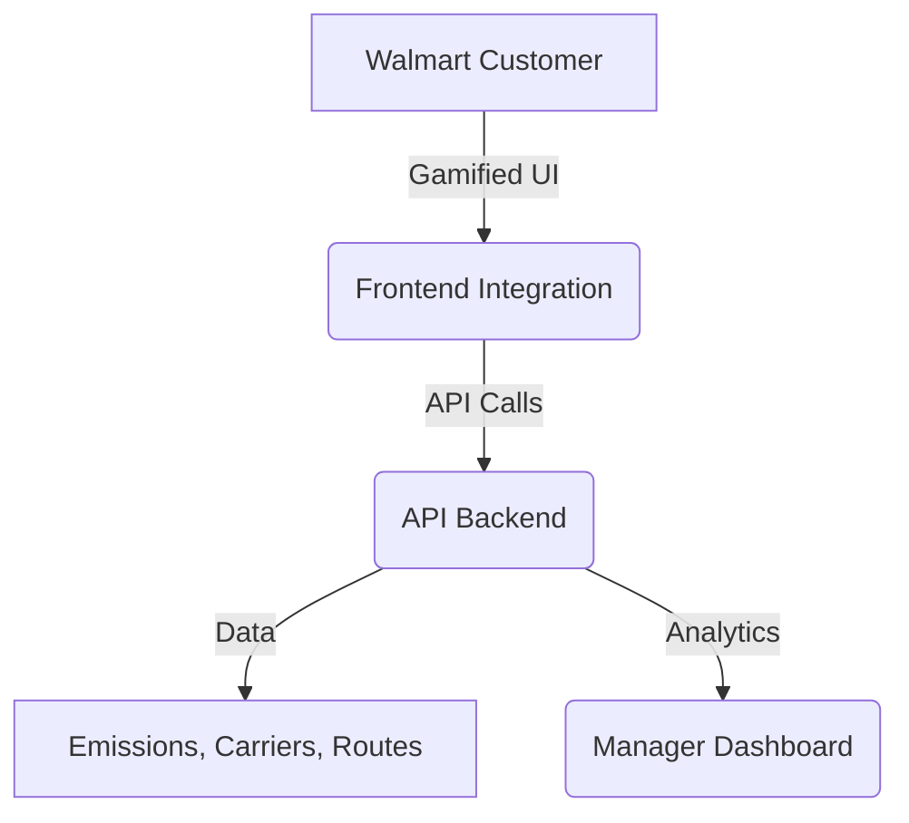

# RouteZero

[](https://youtu.be/eC2GLgUIHks)

**Zero Emissions. Infinite Scale. Walmart’s Intelligent Logistics Layer.**

---

## 📽️ Video Demo

[Click here to watch the demo on YouTube](https://youtu.be/eC2GLgUIHks)

---

## Vision & Context

Every day, thousands of vehicles traverse millions of miles—moving inventory across farms, fulfillment centers, and neighborhoods. Behind this scale lies a cost: billions lost to inefficient routing and rising fuel costs. By 2030, last-mile CO₂ emissions are set to grow 30%, threatening both Walmart’s margins and its mission.

**Meet RouteZero — Walmart’s intelligent logistics layer — focused on reducing emissions and boosting profitability.**

- **Up to 40% reduction in fuel and logistics costs**
- **Gamified Eco Points to improve customer retention**
- **34% CO₂ reduction across test corridors**

At the core are four powerful engines:
- **Carbon-Aware Routing**: Picks the greenest routes, not just the fastest, using elevation, traffic, load, and emissions data.
- **Smart Carrier Matching**: Dynamically assigns EVs, hybrids, or diesel for optimal sustainability and cost.
- **Pickup-Hub Optimization**: Leverages Walmart stores as micro-distribution hubs, clustering deliveries for fewer trips and less idle time.
- **LLM Explainability**: Every routing decision is transparent and AI-aligned, with plain-English explanations for managers and customers.

---

## Architecture



- **API Backend (FastAPI)**: Powers all logistics intelligence, emissions, and explainability.
- **Manager Dashboard (business_facing)**: B2B operational intelligence for Walmart managers, fleet operators, and associates.
- **Customer Integration (frontend-ui)**: B2C layer on Walmart.com, gamifying greener choices and loyalty.

---

## Features

### Walmart Manager Dashboard (B2B Internal Interface)
Empowers Walmart’s supply chain managers with real-time operational intelligence:

- **Carbon-Aware Routing Engine**: Optimizes for lowest carbon per mile, not just speed. Result: 34% CO₂ reduction in test corridors.
- **Intelligent Fleet Matching**: Assigns EVs for city hops, hybrids for mid-range, and efficient diesel for long hauls—mirroring Walmart’s 4,900-EV expansion plan.
- **Hub-Store Pickup Consolidation**: Transforms 8,000+ stores into micro-distribution hubs, clustering deliveries for a 50% drop in delivery emissions.
- **Live Metrics & Analytics**: Executive overview, real-time CO₂ footprint, fleet efficiency, active routes, and weekly savings.
- **Advanced Analytics**: Emissions hotspots, cost breakdowns, and fleet performance.
- **Fleet & Hub Management**: Monitor vehicle efficiency, manage hubs, schedule predictive maintenance, and coordinate teams.
- **Bulk Route Planning**: Plan, optimize, and manage thousands of deliveries at scale.
- **LLM Explainability**: Transparent, AI-aligned explanations for every routing decision.

### Customer-Facing Integration on Walmart.com (Gamification + Loyalty Layer)
Drives customer loyalty and sustainability through gamified experiences:

- **LLM Explainability (/explain-route)**: Every route, vehicle, and delivery time is explained in plain English, aligned with Walmart’s Responsible AI policy.
- **Eco Points & Smart Rescheduling**: Customers earn rewards for greener delivery windows (e.g., “Switch to Friday, earn 30 Eco Points, cashback, or coupons”).
- **Carbon Receipt System**: Every delivery comes with a shareable receipt showing CO₂ saved, packaging reused, and delivery tier.
- **Customer Loyalty Loop**: Top green customers earn extra coupons, next-day delivery credits, and sweepstakes entries—turning sustainability into stickiness and higher basket size.
- **Seamless Nudges**: 65% opt-in rate for greener delivery choices in pilot.

---

## Business Impact

- 💰 **20–40% drop in fuel & logistics ops cost**
- 📦 **Waste reduced via smart batching and real-time updates**
- ♻️ **34% average CO₂ savings per route**
- 🛍️ **+11% customer retention via Eco Point gamification**
- 🧠 **Associate upskilling with transparent AI explanations**
- 🎯 **Fully aligned with Project Gigaton, 2040 zero-emissions fleet, and AI-powered retail 2.0**

---

## Tech Stack

- **Backend**: Python, FastAPI, OpenRouteService, Pydantic, Uvicorn
- **Manager Dashboard**: Next.js, React, Tailwind CSS, Recharts
- **Customer Integration**: React, Leaflet, Google Maps API, Tailwind CSS

---

## Setup & Installation

### 1. API Backend
```bash
cd RouteZero
python -m venv venv
source venv/bin/activate  # or venv\Scripts\activate on Windows
pip install -r requirements.txt
uvicorn main:app --reload
```

### 2. Manager Dashboard
```bash
cd business_facing/dashboard
npm install
npm run dev
```

### 3. Customer Integration Layer
```bash
cd frontend-ui
npm install
npm start
```

---

## API Endpoints (Backend)
- `/route-options` — Get optimized, carbon-aware routes
- `/generate-explanation` — LLM-based explanation for any route
- `/reverse-logistics` — Optimize returns with deliveries
- `/freight-options` — Get freight route and emissions estimate
- `/health` — Health check

---

## Configuration
- Set environment variables in a `.env` file for API keys (e.g., `ORS_API_KEY`, `LLM_API_URL`)
- See `requirements.txt` for backend dependencies
- See each `package.json` for frontend dependencies

---

## Contributing
Pull requests are welcome! For major changes, please open an issue first to discuss what you would like to change.

---

## License
[MIT](LICENSE)


